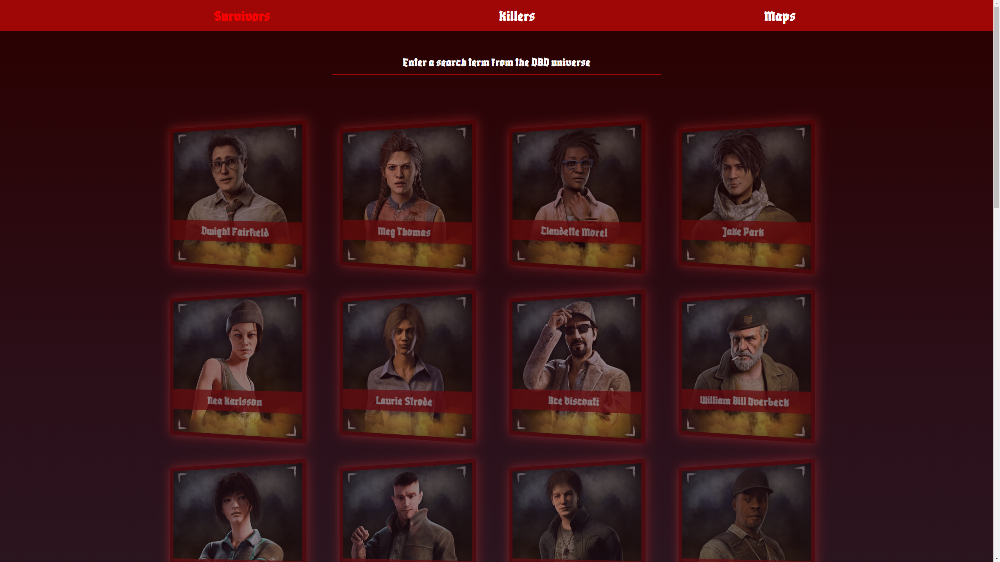
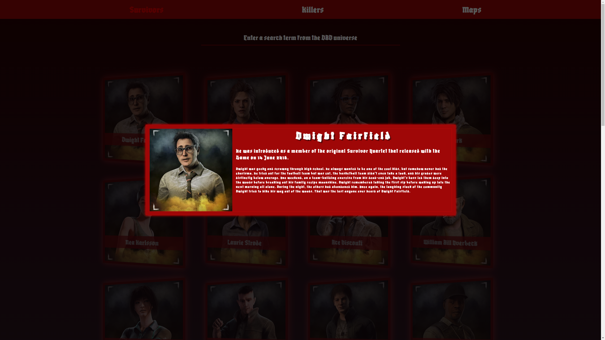
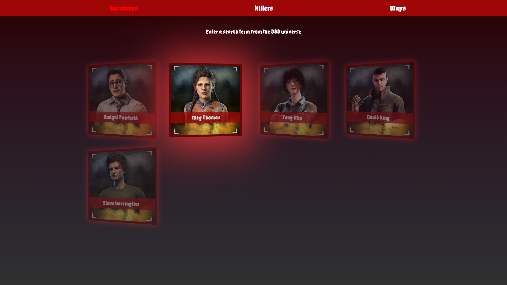
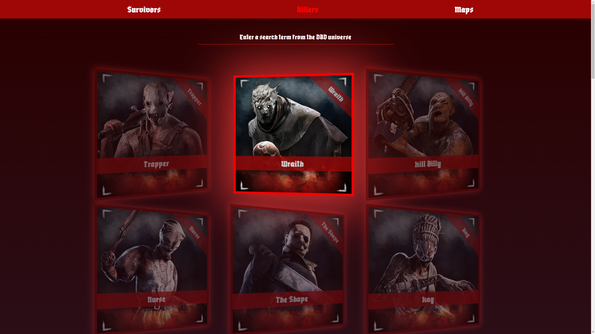
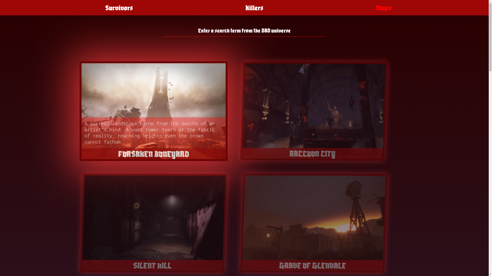

# 
Dead By Daylight Filter page with Vanilla JS
 😎 🥸 🤩
### 
This project is all about some DOM manipulation with vanilla JS (SPA approach).

#### 
There is no focus on performance or something like that

## 
Features of this App

- Using the FETCH API to make backend calls (REST-API)
- Client filtering and input search
- FlexBox
- CSS Animations / Transitions
- SPA approach (only one HTML file (index.html))
- Vanilla JS modal approach
- Playing audio files with event listeners
- Replacing content with JS (DOM / BOM)
- and more...

___

#### 
Dynamic Data List (Survivor / Killers / Maps)

#### 
Dynamic Data Modal

#### 
Data Filter & Search

#### 
Active Audio Showcase

#### 
Animations & Transitions

___
## 
Frontend 🥰

### 
For the frontend we are using serve (npm serve package) to serve the FE folder

- `serve *APPNAME* (on Port 3000 or change it if you want)`
- `(serve ./Frontend) (default port 3000)`

## 
Backend 🤕

### 
For this App we are using a "fake backend" (json-server)

Feel free to add your own backend REST-API here instead

- `json-server --watch ./backend/app-data.json -- --port=5555`

## 
TO-DO 😋

- Load Images from backend
- refactor frontend js code (initializing survivors / killers / maps)
- survivor & killer modals (info cards)
- create home / main page
- create video background on main page
- add survivor perks and images
- add killer modal
- add map modal
- play video on hover (maps)
- map slider
- tbd...

## 
TO-DO-IN-FUTURE 😬

- refactor killer theme (music)
- create repository on GitHub
- Replace fake backend rest api with nodeJs backend (express & mongodb)
- use webpack bundler (maybe)
- tbd...

